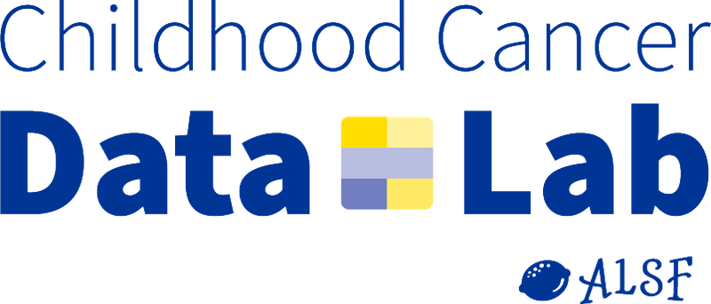

 

The <b><a href="https://www.ccdatalab.org/" title="Alex's Lemonade Stand Foundation">Childhood Cancer Data Lab (CCDL)</a></b> develops tools and training programs to empower childhood cancer researchers to utilize  data to make more robust discoveries.
The Childhood Cancer Data Lab is an initiative of <b><a href="https://www.alexslemonade.org/" title="Alex's Lemonade Stand Foundation">Alex's Lemonade Stand Foundation</a></b>.

You are here because you will be attending one of the following workshops: [Introduction to R](./intro_R) or [Reproducible Research Practices](./rrp).

Please also review our [Code of Conduct](code-of-conduct.md), as well as the [Participant Information](participant-information.md) page for details about workshop locations and other logistics.
Logistical information specific that is specific to a given workshop is available under each workshop's page.

This workshop will introduce the R statististial programming language, including the [`tidyverse`](https://www.tidyverse.org/) suite of packages for data science and visualization, R notebooks, and concepts in reproducible research practices.

**We do not expect attendees to have programming experience.**
The material is designed to help attendees get up and running with software used in this domain.
We will provide resources for learning R to help you prepare and to refer back to as you continue your R journey!

# What you will learn:

* We will introduce the basics of R usage, including working with fundamental data types in R, reading and writing files, and more.
* We will show you how to navigate the RStudio interface.
* We will cover working with data using both base R and tools from the [`tidyverse`](https://www.tidyverse.org/).
* We will introduce you to visualizing data with [`ggplot2`](https://ggplot2.tidyverse.org/).
* We will demonstrate using [RMarkdown notebooks](https://rmarkdown.rstudio.com/) for reproducible analysis.

# What you will not learn:

* We won't be able to cover all of R! This is a lifelong learning process. We're still learning too!
* We won't address the specifics of analyzing "omics" data, e.g., RNA-seq analysis pipelines.
* We won't explicitly cover the use of any Bioconductor packages. This course is only base R and `tidyverse`.
* We won't be covering other related topics in computing like UNIX or version control.

<!--
**Looking for more?**
We have compiled a set of [useful resources](reproducibility_resources.md) that support reproducible computational research that we recommend for your future reading and exploration!
-->